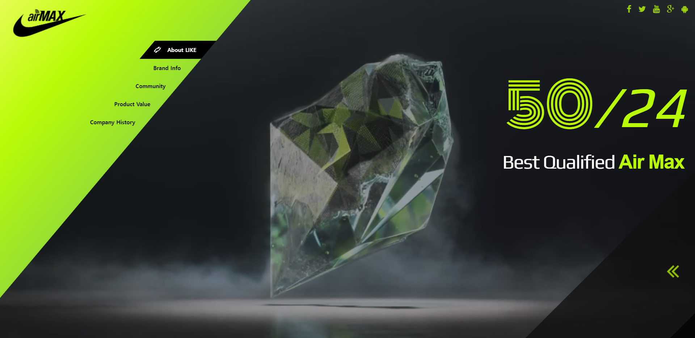

# 인터렉티브 디자인을 위한 첫번째 과제1

## 배경 동영상을 활용한 웹 페이지

### 사용 기술

> **HTML5 태그** 와 **video 태그** **gradient** **box-sizing** **transtion** **animation** **web font icon** **google web font** **transform**

### step

> **1** : 이미지와 reset.css 파일 들을 준비함

> **2** : 배경에 자동 재생된느 동영상 깔기

> **3** : 옆으로 비스듬히 누운 헤더 및 메뉴 만들기

> **4** : 메뉴 오버시 2차 메뉴 나타내기

> **5** : 간단한 모션의 SNS 버튼 모음 만들기

> **6** : 텍스트 박스 생성 및 웹폰트 연결

> **7** : 콘텐츠 박스 생성 및 모션 적용하기

> **8** : 자동으로 움직이는 애니메이션 버튼 만들기

### result

