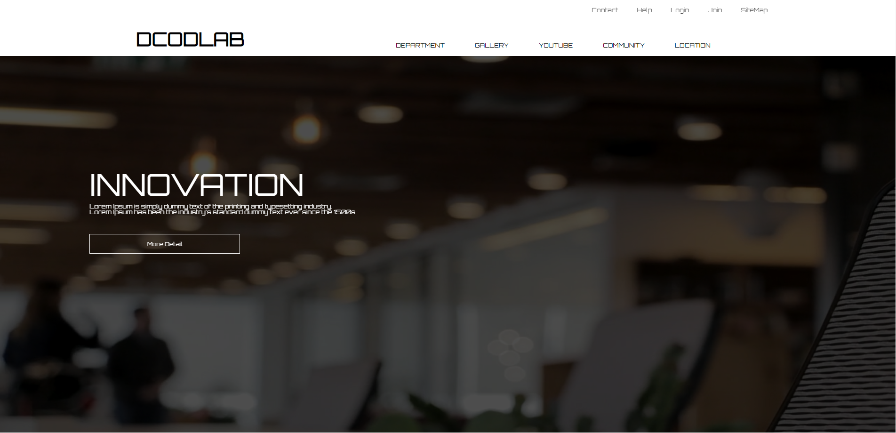
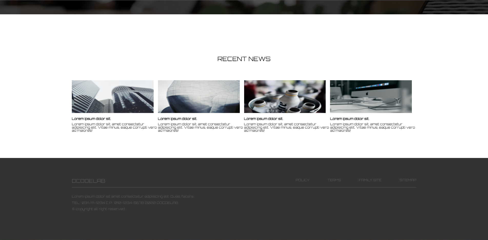

# 인터렉티브 디자인을 위한 두번째 과제

## 기업형 웹 페이지 제작하기

### 사용 기술

1. Transform
2. 이벤트 연결
3. jQuery
4. index()
5. overflow
6. web font icon
7. google web font
8. animation
9.  

### step

> **1** : 이미지와 reset.css 파일 들을 준비함
>   **2** : 기본 레이아웃 설정
>   **3** : 헤더 영역 완성하기
>   **4** : figure 영역 완성하기
>   **5** : section 영역 완성하기
>   **6** : footer 영역 완성하기
>   기업형 웹페이지를 작성할 떄에는 영역관리 및 나누기가 제일 중요하다고 생각한다.
 

### result

 
