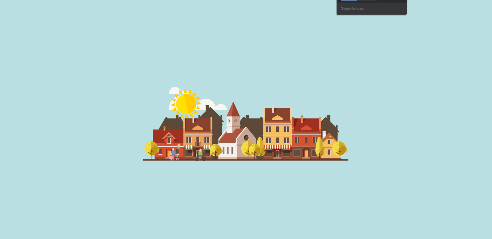
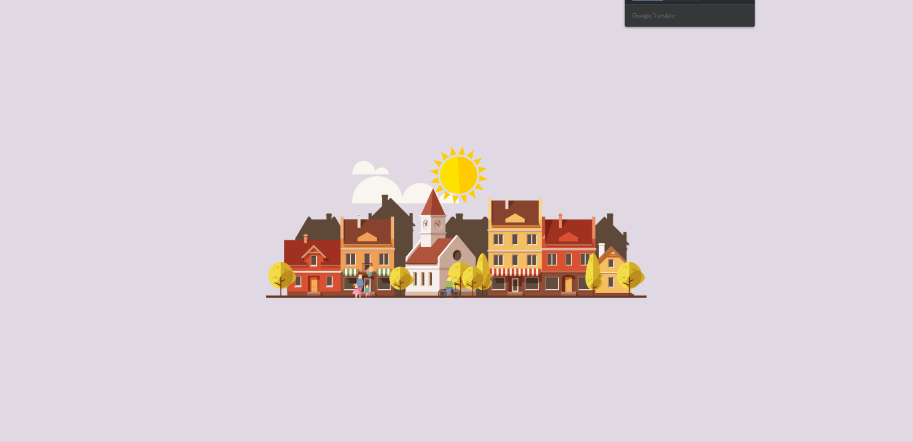
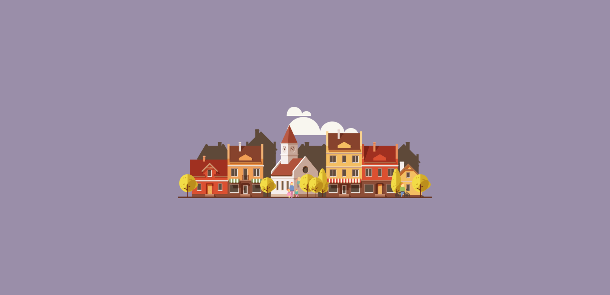
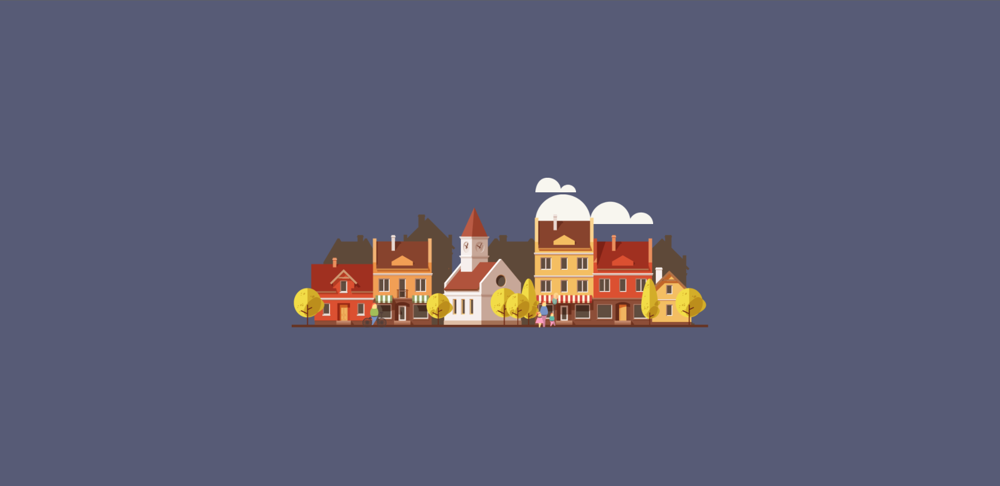

# 인터렉티브 디자인을 위한 두번째 과제

## 마을 애니메이션

### 결과 페이지

> https://libtv.github.io/interactive-city/ 
 

### 사용 기술

1. Transform
2. 이벤트 연결
3. jQuery
4. index()
5. overflow
6. web font icon
7. google web font
8. animation
 

### step

> **1** : 이미지와 reset.css 파일 들을 준비함
>   **2** : 기본 레이아웃 설정
>   **3** : 배경과 콘텐츠 영역 설정
>   **4** : 텍스트와 구름 태양 배치
>   **5** : 마을 건물 배치
>   **6** : 각 요소에 적용할 키 프레임 설정
 

### result

 
