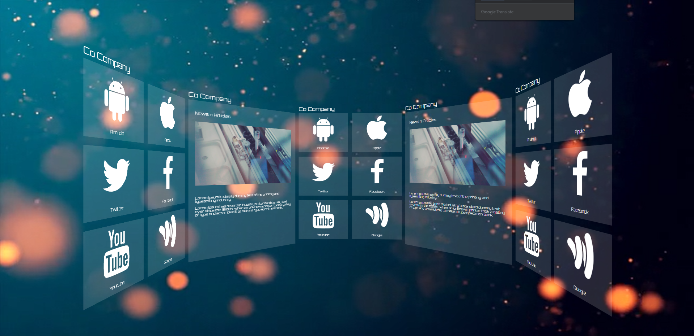

# 인터렉티브 디자인을 위한 두번째 과제

## 파노라마 회사 소개 페이지 제작하기

### 사용 기술

1. Transform
2. 이벤트 연결
3. jQuery
4. index()
5. overflow
6. web font icon
7. google web font
8. animation
 

### step

> **1** : 이미지와 reset.css 파일 들을 준비함
>   **2** : 기본 레이아웃 설정
>   **3** : 풀 스크린 배경에 동영상 삽입하기
>   **4** : 콘텐츠 박스를 묶는 부모 프레임 생성하기
>   **5** : 콘텐츠 박스 8개의 공통 스타일 지정하기
>   **6** : 박스 콘텐츠 만들기
>   **7** : 박스를 3D 형태로 배치하기
>   **8** : 모션 제어하기
 

### result

 
