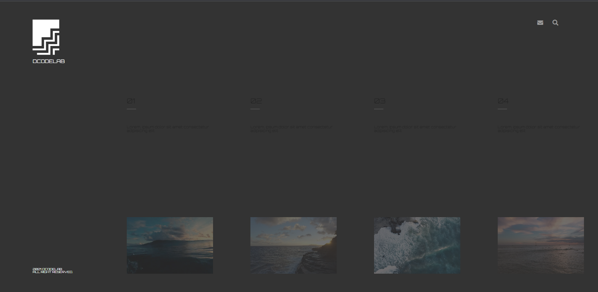
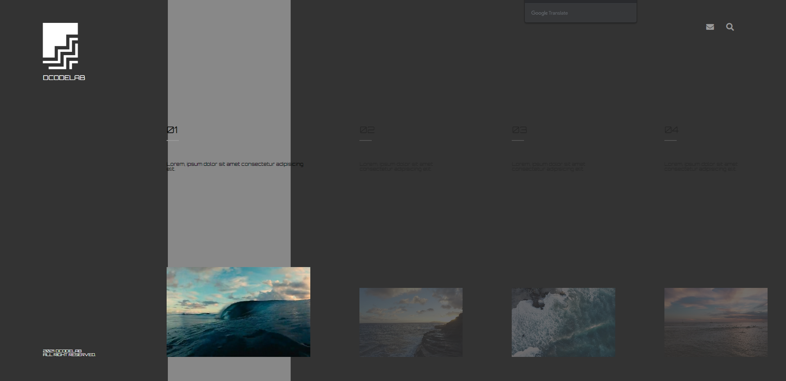
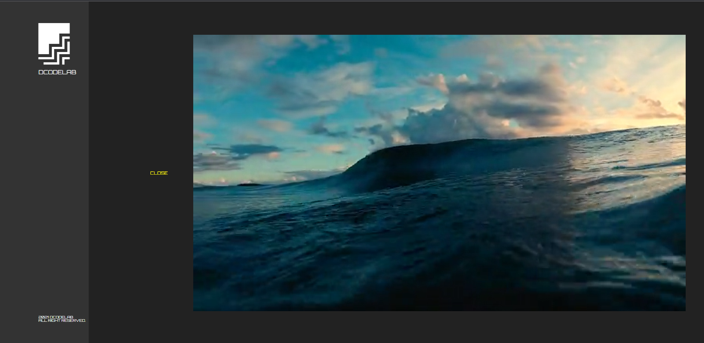

# 인터렉티브 디자인을 위한 두번째 과제

## flex 기반 동영상 웹 페이지

### 결과 페이지

> https://libtv.github.io/interative-flex-video/
 

### 사용 기술

1. Transform
2. 이벤트 연결
3. jQuery
4. index()
5. overflow
6. web font icon
7. google web font
8. animation
 

### step

> **1** : 이미지와 reset.css 파일 들을 준비함
>   **2** : 기본 레이아웃 설정
>   **3** : flex로 풀 스크린 레이아웃 구성하기
>   **4** : header 영역 콘텐츠 채우기
>   **5** : nav영역 콘텐츠 채우기
>   **6** : 메인 콘텐츠 article 영역 채우기
>   **7** : 동영상 박스 추가하기
>   **8** : article 영역에 호버 효과 적용하기
>   **9** : 마우스 프인터 올리면 동영상 재생하기
 

### result

 
