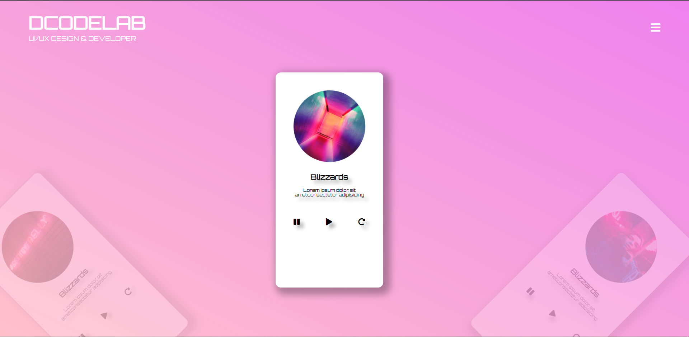

# 인터렉티브 디자인을 위한 두번째 과제

## 뮤직 플레이어 제작

### 사용 기술

1. Transform
2. 이벤트 연결
3. jQuery
4. index()
5. overflow
6. web font icon
7. google web font
8. animation
 

### step

> **1** : 이미지와 reset.css 파일 들을 준비함
>   **2** : 기본 레이아웃 설정
>   **3** : 뮤직 플레이어 패널 생성
>   **4** : article 패널을 자바스크립트로 회전시키기
>   **5** : 전체 패널 아래쪽으로 내리기
>   **6** : 가운데 패널 활성화시키기
>   **7** : 패널에 음악 커버 이미지 생성하기
>   **8** : 음악 정보와 컨트롤 버튼 생성하기
>   **9** : 컨트롤 패널 버튼으로 음악을 재생 정지하기
>   **10** : 좌우 버튼 클릭시 패널 회전시키기
 

### result

