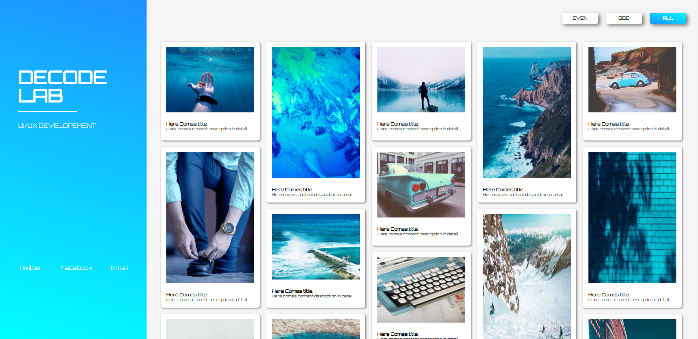
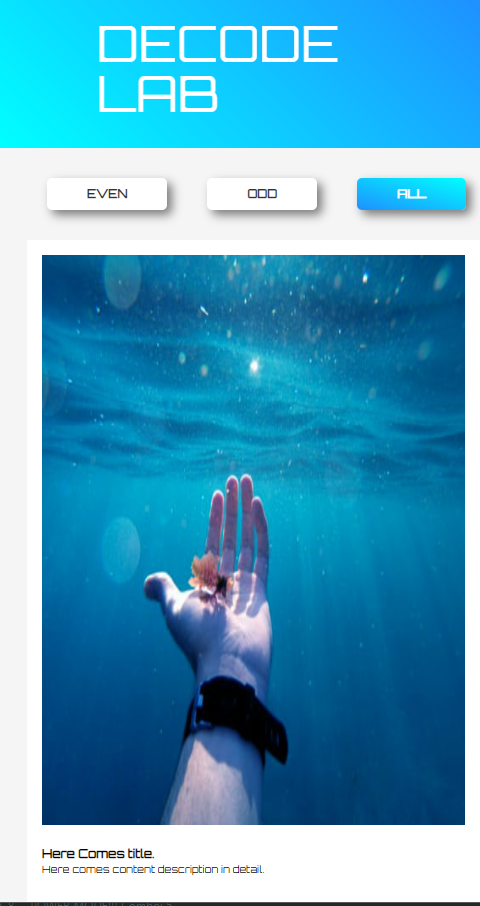

# 인터렉티브 디자인을 위한 두번째 과제

## 핀터레스트 스타일의 반응형 웹 갤러리 제작하기

 

### 관련 페이지
>  https://libtv.github.io/interactive-media-query/

 

### 사용 기술
1. isotope 플러그인   
   **@import** :  
   <code></code>  
   **@code** :  
   <code>
   const grid = new Isotope("#contents-wrap", {
   itemSeletor: ".content",
   columnWidth: ".content",
   transitionDuration: "0.5s",
   });
   </code>  
   <code>
   grid.arrange({
   filter: ".on",
   });
   </code>
     
2. Transform
3. 이벤트 연결
4. jQuery
5. index()
6. overflow
7. web font icon
8. google web font
9. animation

 

### step
> **1** : 이미지와 reset.css 파일 들을 준비함
>   **2** : 기본 레이아웃 설정
>   **3** : 세로형 메뉴 구조 레이아웃 제작하기
>   **4** : 헤더 영역에 로고 추가하기
>   **5** : 헤더 영역 하단에 SNS 버튼 제작하기
>   **6** : 오른쪽 메인 영역에 갤러리 이미지 추가하기
>   **7** : float 배치한 레이아웃 재정렬하기
>   **8** : 미디어쿼리를 이용하여 반응형 웹 제작하기

 

### result

