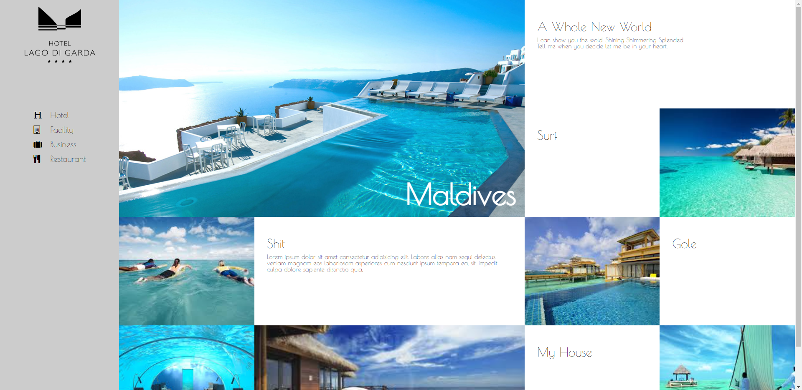

# 인터렉티브 디자인을 위한 첫번째 과제2

## 화면의 폭에 따라 변하는 웹 레이아웃

### 사용 기술

> **media query** 와 **nth-child()** **box-sizing** **transition** **overflow** **animation** **web font icon** **google web font** **transform**

### step

> **1** : 이미지와 reset.css 파일 들을 준비함

> **2** : 가로 폭 1600px 이상에서의 기본 레이아웃 설정

> **3** : 미디어쿼리로 화면 폭마다 레아이웃 다르게 설정하기

> **4** : 레이아웃 마다 헤더 설정

> **5** : 레이아웃 마다 아티클 설정

### result

