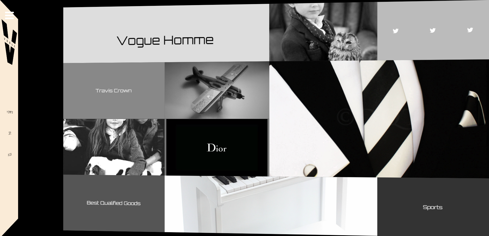

# 인터렉티브 디자인을 위한 첫번째 과제3

## 입체적으로 회전하는 웹 레이아웃

### 사용 기술

> **transform** 와 **nth-child()** **jQuery** **transition** **overflow** **animation** **web font icon** **google web font** **index** **addClass/removeClass** **fadeIn/fadeOut**

### step

> **1** : 이미지와 reset.css 파일 들을 준비함

> **2** : 기본 레이아웃 설정

> **3** : 메뉴 버튼 클릭시 nav 영역과 section 영역 모션 구현하기

> **4** : secion 안의 box1 box2 box3 콘텐츠 레이아웃 잡기

> **5** : box1 box2 box3 콘텐츠 모션 잡기

> **6** : 각각의 박스 안에 콘텐츠 채워넣기

### result

