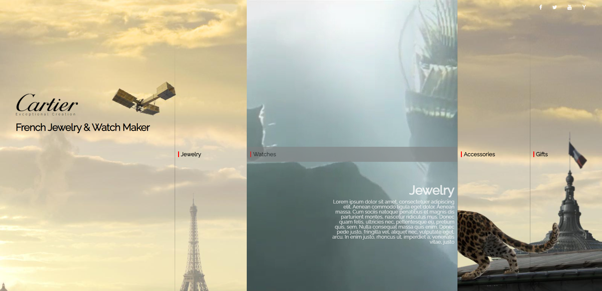

# 인터렉티브 디자인을 위한 첫번째 과제4

## 마우스 오버 시 동영상이 재생되는 콘텐츠 박스

### 사용 기술

> **transform** 와 **nth-child()** **jQuery** **transition** **overflow** **animation** **web font icon** **google web font** **video** **addClass/removeClass**

### step

> **1** : 이미지와 reset.css 파일 들을 준비함

> **2** : 기본 레이아웃 설정

> **3** : 마우스 오버 시 해당 요소 모션 걸기

> **4** : 해당 요소의 모션 직후 새로운 텍스트 모션 걸기

### result

