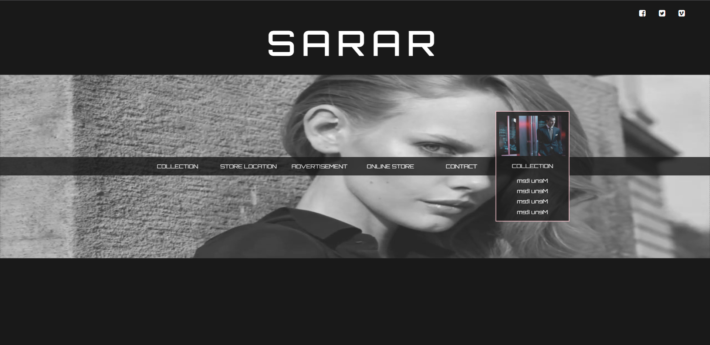

# 인터렉티브 디자인을 위한 첫번째 과제5

## 마우스 움직임에 따라 제어되는 이미지 시퀀스

### 사용 기술

> **이벤트 연결** 와 **e.pageX/e.pageY** **jQuery** **transition** **overflow** **width()** **web font icon** **google web font** **fadeIn/fadeOut**

### step

> **1** : 이미지와 reset.css 파일 들을 준비함

> **2** : 기본 레이아웃 설정

> **3** : for문을 이용해 200개의 이미지 동적으로 생성

> **4** : 브라우저상에서 마우스 무브 시 이미지가 순차적으로 보이도록 연동

### result

