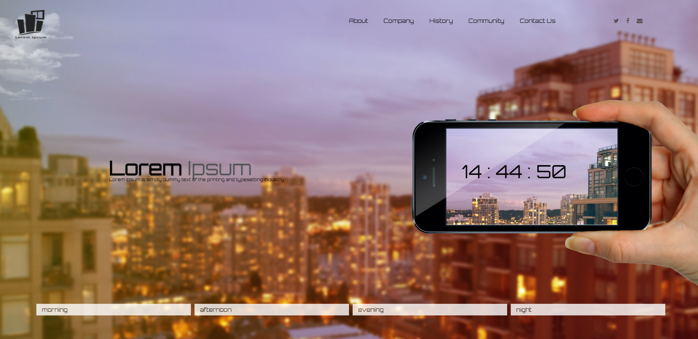

# 인터렉티브 디자인을 위한 첫번째 과제6

## 시간에 따라 달라지는 웹 디자인

### 사용 기술

> **이벤트 연결** 와 **new Date()** **jQuery** **transition** **overflow** **.text()** **web font icon** **google web font** **.setInterval()** **addClass()** **animation**

### step

> **1** : 이미지와 reset.css 파일 들을 준비함

> **2** : 기본 레이아웃 설정

> **3** : animation을 통해 구름의 움직임 설정하기

> **4** : 시간대 별 디자인 테마 설정하기

> **5** : 현재 시간 화면에 출력하기

> **6** : 현재 시간에 맞는 디자인 테마 자동으로 연결하기

### result

