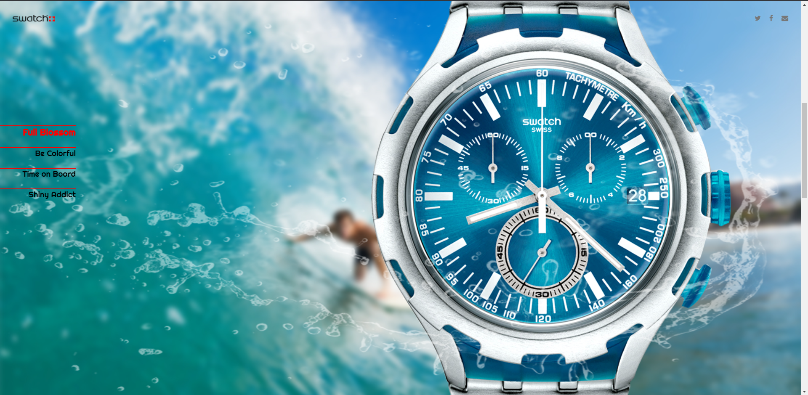

# 인터렉티브 디자인을 위한 첫번째 과제7

## 마우스 휠의 움직임에 따라 스크롤되는 웹 페이지

### 사용 기술

> **이벤트 연결** 와 **width/height** **jQuery** **scrollTop()** **overflow** **offset().top** **web font icon** **google web font** **.setInterval()** **mousewheel** **animation** **scrollTop()**

### step

> **1** : 이미지와 reset.css 파일 들을 준비함

> **2** : 기본 레이아웃 설정

> **3** : section 높이를 브라우저 높이의 값으로 자동 설정하기

> **4** : 마우스의 움직임에 반응하는 서브 이미지 설정하기

> **5** : 주 메뉴 클릭 시 자동으로 상하 스크롤하기

> **6** : 마우스 휠의 움직임에 따라 화면 스크롤 시키기

### result

