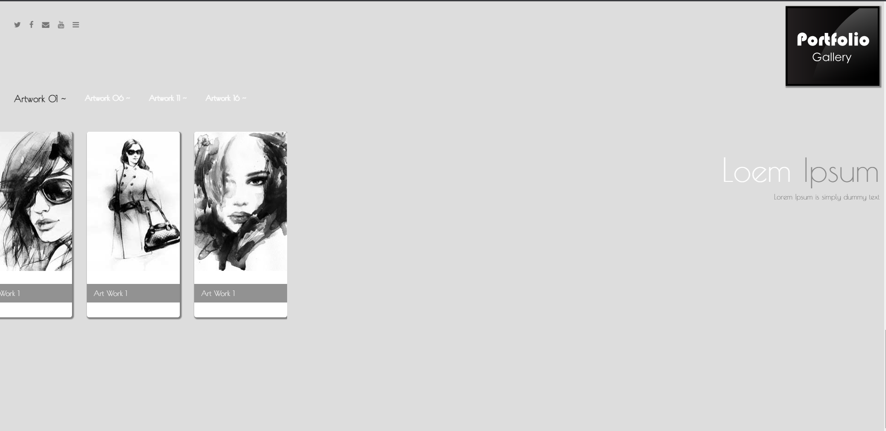

# 인터렉티브 디자인을 위한 첫번째 과제7

## 마우스 휠의 움직임에 따라 스크롤되는 웹 페이지

### 사용 기술

> **이벤트 연결** 와 **width/height** **jQuery** **indx()** **overflow** **offset().top** **web font icon** **google web font** **animation** **scrollTop()**

### step

> **1** : 이미지와 reset.css 파일 들을 준비함

> **2** : 기본 레이아웃 설정

> **3** : 화면을 상하로 스크롤할 때 section 그룹을 좌우로 움직이기

> **4** : 페이지 로딩 시 화면 제일 아래쪽으로 자동 스크롤하기

> **5** : 각각 article 요소의 열리고 닫힘 효과 부여하기

### result

